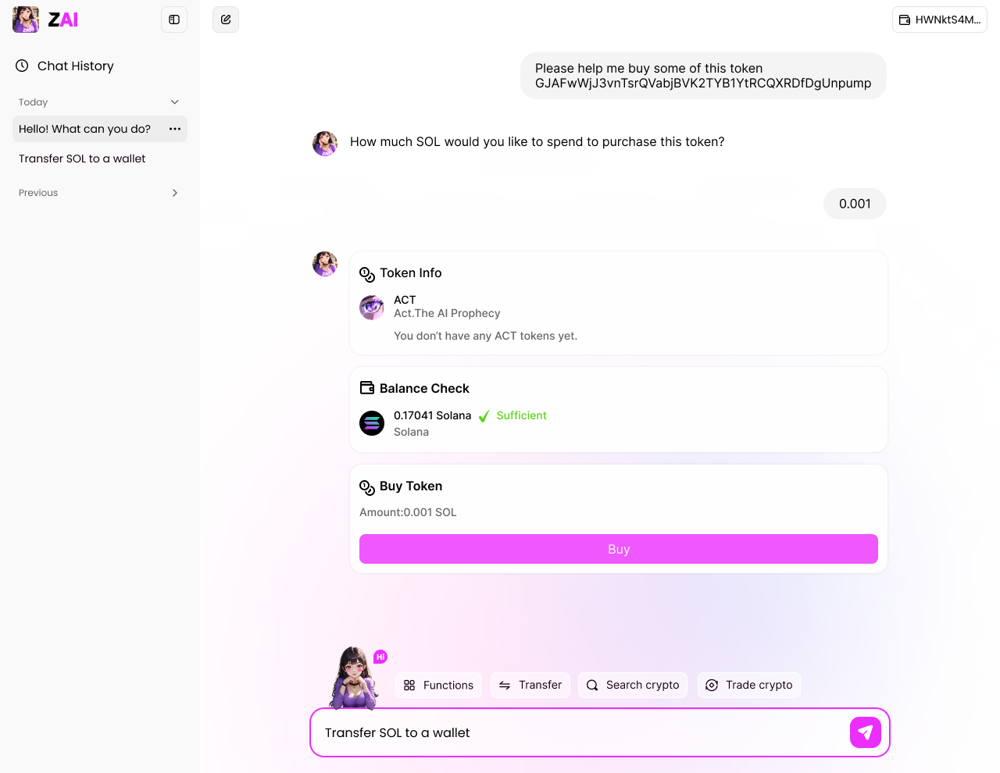
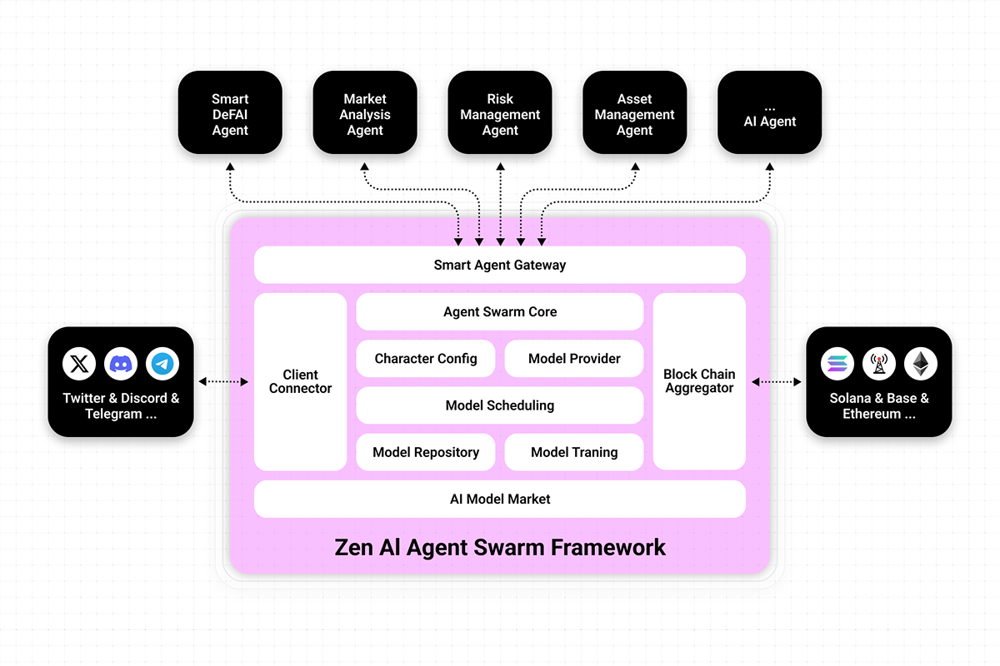

# Introduction
## Discover ZAI
## Unlocking Crypto Freedom with AI for Normies
**ZAI is an open-source AI agent gateway designed to onboard billions of normies. It pioneers intuitive, streamlined multi-agent orchestration to accelerate crypto mass adoption. With ZAI, users can seamlessly interact with decentralized financial systems — including memecoins, dApps, NFTs, and more—using natural language inputs like text and voice.**  

  

  
## Features & Capabilities
- **Immersive UI:** Personalized, installation-free, mobile-friendly interface
- **Natural Language Interaction:** Use text or voice to access blockchain services like transfers, DeFi, and NFT issuance
- **Social Login Wallet:** Create a non-custodial wallet using social media accounts
- **Social Airdrops & Transfers:** Send and receive crypto via social media IDs
- **Zero Gas Fees:** Pay fees with non-SOL tokens, starting with $ZAI
- **Expert Trading Mode:** Advanced tools like candlestick charts for pro users
- **DeFi Integration:** Integrate DeFi protocols for DEX LP management, borrowing/lending, staking, etc.
- **Ecosystem Building:** Open SDK to encourage third-party adoption and growth
- And many more...
# Roadmap
We aim to build an infrastructure centered around an **AI Agent Swarm**, enabling billions of people worldwide to easily access and use decentralized finance. Our goal is to bring true **Crypto Freedom** to everyday users.
## Core Architecture

- [x] Agent Swarm Core
- [x] Smart Agent Gateway
- [x] Character Config
- [x] ChatGPT GPT-4O Integration
- [ ] DeepSeek Integration
- [x] Third-party Wallet Integration
- [ ] Social Media Wallet Integration
- [ ] TEE Integration
## Agent Capabilities
- [x] Token Transfer(Solana)
- [x] Basic Token Analysis
- [x] E Charts Integration
- [ ] K Charts Integration 
- [ ] Memory Layer
- [ ] Twitter Login
- [ ] Tiktok Login
- [ ] Voice Interaction
- [ ] Market Analysis
## DeFAI Integrations
- [x] Token Swap
- [x] Jupiter Integration
- [x] Raydium Integration
- [x] Cookie Fun Integration
- [ ] Pump Fun Token Deploy
- [ ] SNS(Solana Name Service) Resovlver
- [ ] NFT Trading
- [ ] Dexscreener/GMGN Integration
- [ ] DEX LP Management
- [ ] Borrowing & Lending
- [ ] Staking Services
- [ ] Cross-chain Interoperability
# Links
- X(Twitter): https://x.com/ZAIAgents
- Youtube: https://www.youtube.com/@ZAIAgents
- Website: https://www.zaiworld.ai

